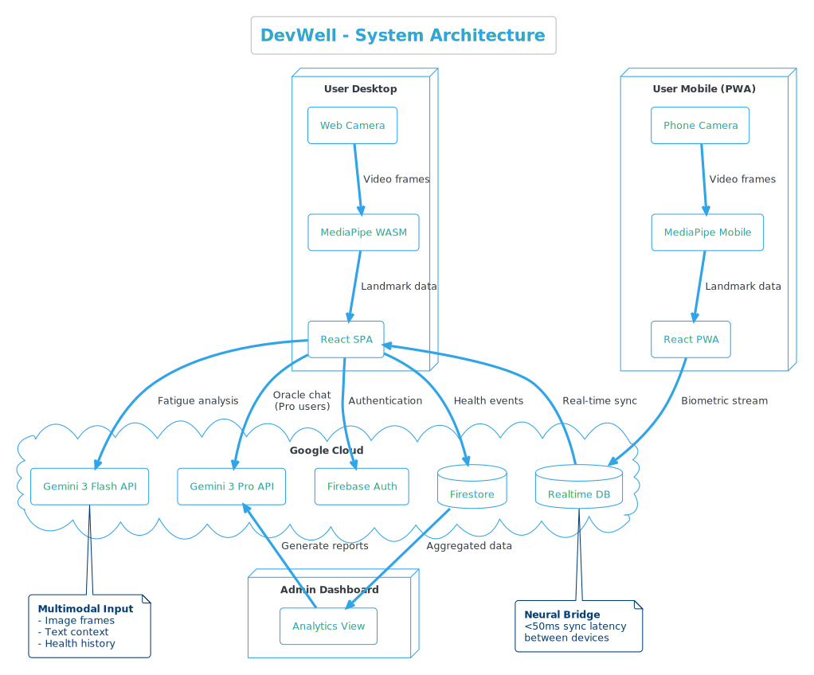
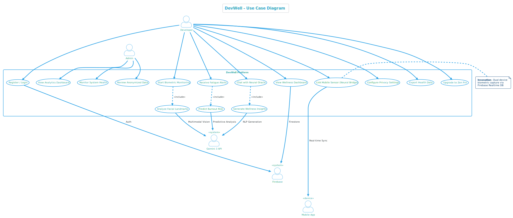
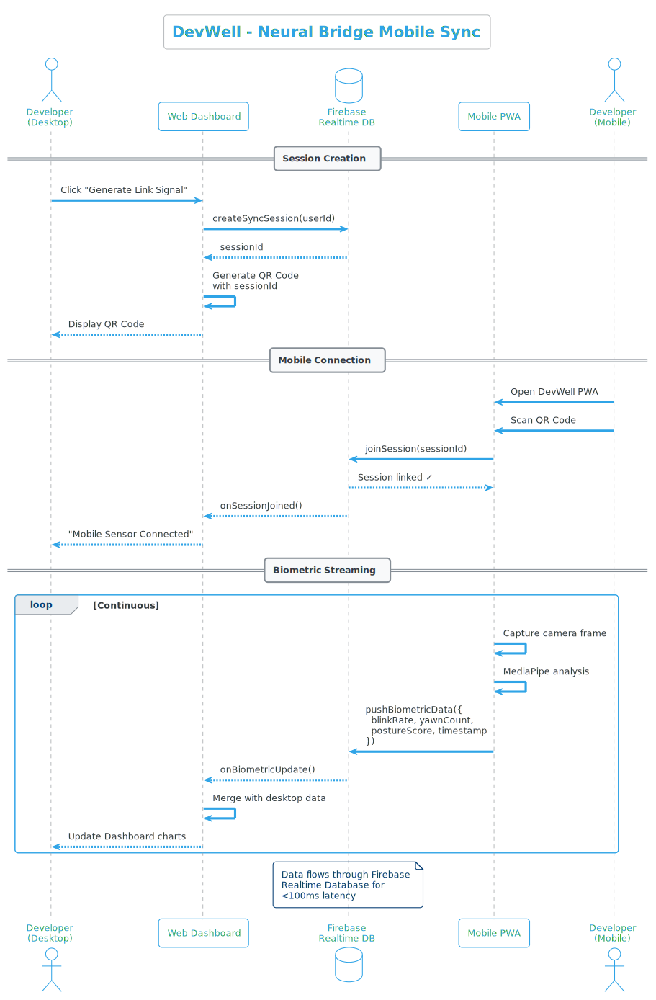
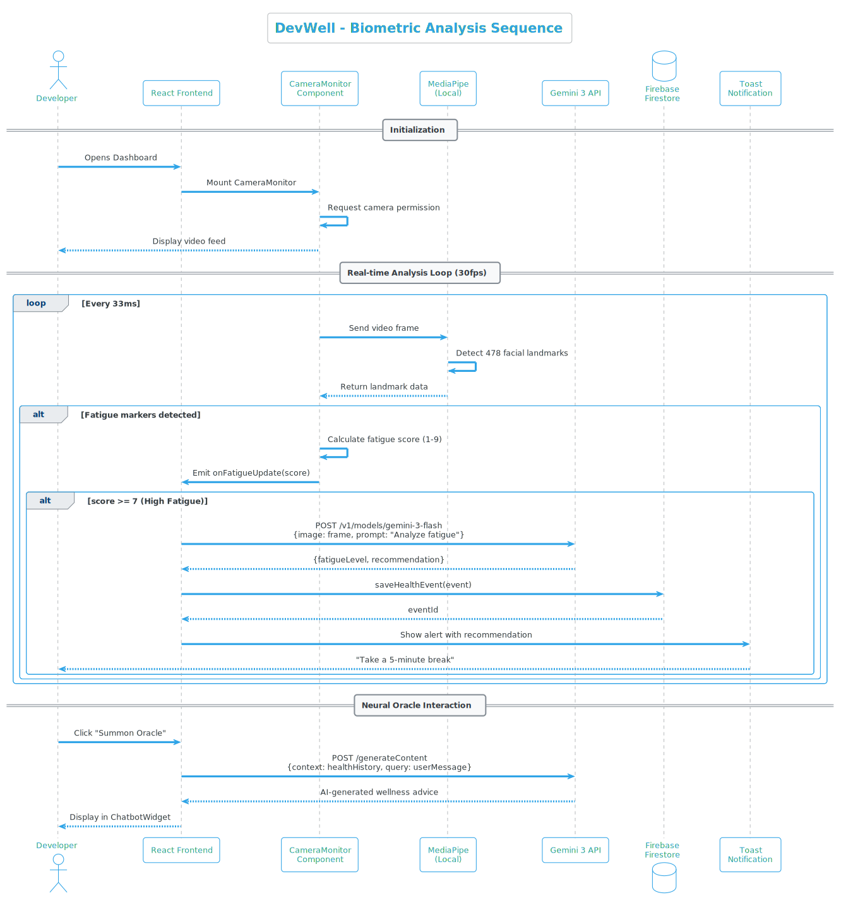
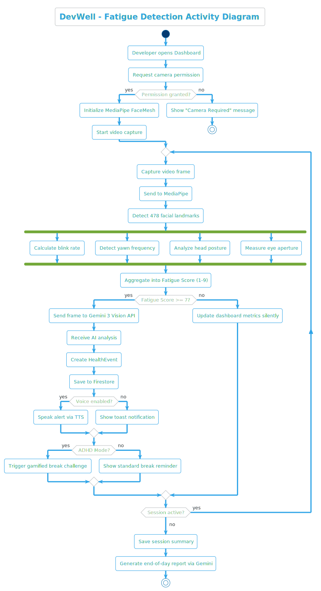
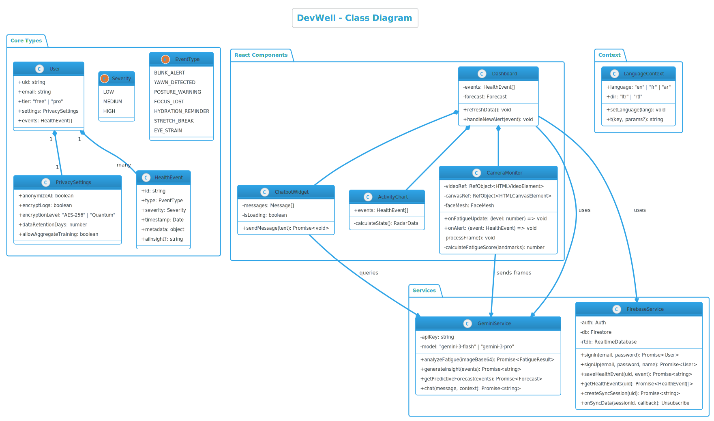

<div align="center">
  <br />
  <h1 align="center">DevWell</h1>
  <p align="center"><strong>The Neural-First Developer Wellness Ecosystem</strong></p>
  <p align="center">
    Optimizing biological runtime for peak cognitive performance.
  </p>
  <br />
</div>

> **Note:** DevWell leverages computer vision and AI behavioral analysis. All processing is done locally or encrypted end-to-end.

## ⚡ Overview

**DevWell** is a futuristic productivity suite that bridges the gap between biological needs and digital demands. It acts as a background monitor for developers, using webcam input to analyze posture, fatigue, and focus levels in real-time. By synchronizing your work patterns with your circadian rhythm, DevWell helps prevent burnout determining factors.

> **Impact:** Developer burnout costs the global tech industry an estimated **$300 Billion annually** in lost productivity and turnover. DevWell aims to reclaim this lost potential.

The ecosystem consists of two main components:

1. **The Neural Hub (Web App):** The central dashboard for analytics and configuration.
2. **The Remote Probe (Mobile App):** A dedicated sensor interface that turns any smartphone into a remote biometric tracker, offloading CPU usage from your main machine.

## 🚀 Key Features

### 🧠 Neural Hub (Dashboard)

- **Real-Time Biometrics:** Live tracking of posture quality, distance from screen, and blink rates.
- **Wellness Score:** A dynamic `0-100` health index updated in real-time.
- **Focus Trends:** Visualization of deep work sessions vs. distracted periods.
- **Glassmorphism UI:** A sleek, dark-mode-first aesthetic built for low-light coding environments.

### 🔮 The Oracle (AI Assistant)

- **Gemini Integration:** Powered by Google's **Gemini 3 Pro** model.
- **Smart Recommendations:** Context-aware suggestions for breaks, stretches, or hydration based on your specific fatigue metrics.
- **Proactive Health:** Detects signs of "Zombie Mode" (coding while exhausted) and intervenes.

### 📱 Remote Probe Integration

- **Dual-Device Architecture:** Connect your phone via QR code.
- **Resource Offloading:** Moves computer vision processing to the mobile device to save dev-machine CPU.
- **AES-256 Encryption:** Military-grade encryption (GCM mode) for all data streams between mobile and desktop layers.

### 📊 Pro Analytics

- **Cortisol Heatmaps:** Track stress levels across the week to identify burnout patterns.
- **Circadian Rhythm Mapping:** Predictive energy modeling.
- **Posture Velocity:** Advanced spine alignment tracking over time.

## 🛠 Tech Stack

### Core

- **Framework:** React 18 + Vite
- **Language:** TypeScript
- **Styling:** Tailwind CSS + Custom Animations
- **Icons:** Lucide React

### Backend & Services

- **Database:** Firebase Firestore (Realtime Sync)
- **Functions:** Firebase Cloud Functions
- **AI:** Google Gemini API
- **Security:** Web Crypto API (Native AES-GCM)

### Mobile (Probe)

- **PWA:** Progressive Web App capable
- **Camera:** MediaStream API with localized specific processing

## 🏗 Setup & Installation

### 1. Clone the Repository

```bash
git clone https://github.com/yourusername/devwell-v2.git
cd devwell-v2
```

### 2. Environment Configuration

Create a `.env` file in the root directory:

```env
VITE_GEMINI_API_KEY=your_gemini_key_here
VITE_FIREBASE_API_KEY=your_firebase_key
VITE_FIREBASE_AUTH_DOMAIN=...
VITE_FIREBASE_PROJECT_ID=...
# ... other standard firebase config
```

### 3. Install Dependencies

```bash
npm install
```

### 4. Run Development Server

```bash
npm run dev
```

## 📐 System Architecture

### High-Level Architecture


### Use Case Diagram


### Sequence Diagrams
**Mobile Sync & Data Flow**


**Biometric Analysis**


### Activity Flow (Core Logic)


### Class Structure


### 5. Running the Mobile Probe

The mobile probe is located in the `devwell-remote-probe` folder (or served via `/probe` in production).
To run it separately:

```bash
cd ../devwell-remote-probe
npm install
npm run dev
```

## 🔒 Security Architecture

DevWell takes privacy seriously. We monitor you, so others don't have to.

- **Local-First Processing:** Computer vision algorithms run in the browser/app. Video streams are not stored.
- **Encrypted Sync:** When using the Remote Probe, the handshake and subsequent data stream are encrypted using **AES-256-GCM**.
  - Keys are ephemeral or derived from session secrets.
  - `utils/encryption.ts` handles the cryptographic primitives.

## 🤝 Contributing

1. Fork the Project
2. Create your Feature Branch (`git checkout -b feature/AmazingFeature`)
3. Commit your Changes (`git commit -m 'Add some AmazingFeature'`)
4. Push to the Branch (`git push origin feature/AmazingFeature`)
5. Open a Pull Request

## 📄 License

Distributed under the MIT License. See `LICENSE` for more information.

---

<div align="center">
  <p>Built with ❤️ and ☕ by <strong>Anas Kessou</strong></p>
</div>
